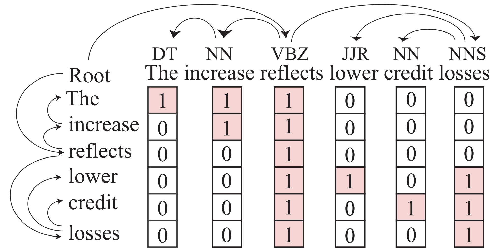

# SG-Net: Syntax-Guided Machine Reading Comprehension

 Codes for the AAAI 2020 paper **SG-Net: Syntax-Guided Machine Reading Comprehension**

*working in progress



## Installation
pip install -r requirements.txt

## Instructions
You can run the model with the script *run_squad.sh* and *run_race.sh*.

We upload the processed example data in *data* folder which is annotated by our dependency labeler for quick practice. 

The labeler model is the [HPSG-Neural-Parser](https://github.com/DoodleJZ/HPSG-Neural-Parser). The implementation for this work will be publicly available soon. 

### Reference

Please kindly cite this paper in your publications if it helps your research:

```
@inproceedings{zhang2019sgnet,
    title={{SG-Net}: Syntax-Guided Machine Reading Comprehension},
    author={Zhang, Zhuosheng and Wu, Yuwei and Zhou, Junru and Duan, Sufeng and Zhao, Hai and Wang, Rui},
    booktitle={Proceedings of the Thirty-Fourth AAAI Conference on Artificial Intelligence},
    year={2020}
}
```

:)